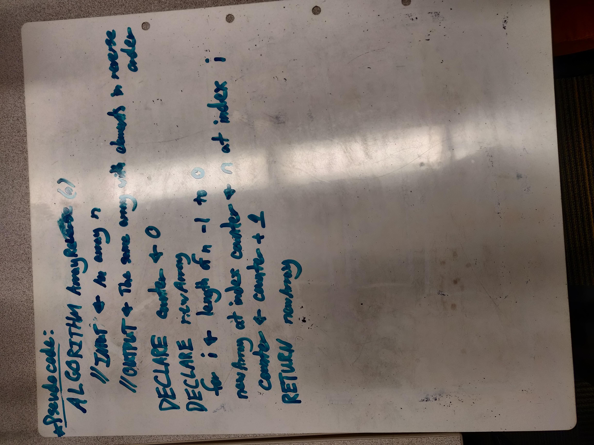

# Reverse Array

For our first coding challenge of code 401 we have been tasked to accept an inputted array of numbers and then return an a new array of the same numbers with in reverse order. We have also been asked to do this without access to any of the built-in Array Methods of ES6. 

## Challenge

Reverse an Array.

## Approach and Efficiency 

We took the approach of declaring a counter to represent the number of array elements we visited while also decrementing a for loop so that the last element of the source array would be transposed to the first index position of the new array and so on for the length of the array. I believe time complexity should be O(n) or linear time. This is a guess after some quick reading and I am still uncertain as to how to calculate space complexity.  

## Solution

